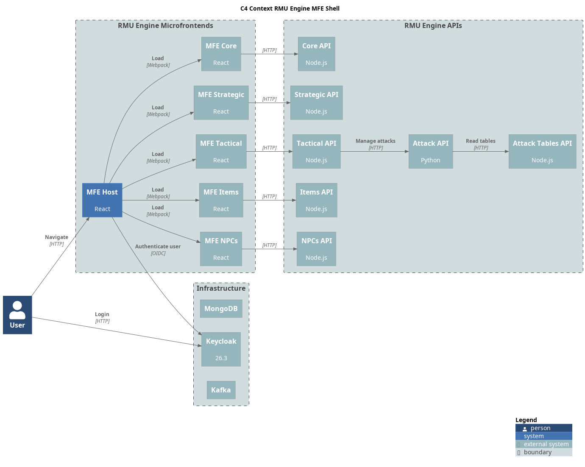

= Rolemaster Unified Frontend Host

React-based microfrontend for tactical games management. This project is the entry point for RMU's microfronteds.

This project is part of RMU Online: https://github.com/labcabrera/rmu-platform

WARNING: *This application is an independent project developed by fans of Rolemaster Unified. It is not affiliated with, endorsed by, or licensed by Iron Crown Enterprises (ICE), the owners of the Rolemaster intellectual property.*
*All Rolemaster trademarks, game systems, and materials are the property of Iron Crown Enterprises. This software is provided for personal, non-commercial use only. If you enjoy Rolemaster, please support the official publications and content from ICE.*



== Module Federation & Authentication

This host application exposes authentication components and utilities for consumption by remote microservices through Module Federation.

=== Exposed Components

The following authentication components are available to remote modules:

* `host/auth` - Complete authentication module (recommended)
* `host/AuthContext` - Authentication context and hooks
* `host/AuthService` - Keycloak authentication service
* `host/UserMenu` - User menu component with login/logout
* `host/AuthLoader` - Loading component for auth states
* `host/ProtectedRoute` - Route protection component
* `host/AuthDebug` - Debug component for authentication

=== Quick Start for Microservices

```javascript
// In your microservice
import { useAuth, ProtectedRoute } from 'host/auth';

function MicroserviceApp() {
  const { isAuthenticated, user } = useAuth();
  
  return (
    <ProtectedRoute>
      <div>Welcome {user?.name}!</div>
    </ProtectedRoute>
  );
}
```

See link:docs/AUTHENTICATION.md[Authentication Documentation] for detailed integration guide.
